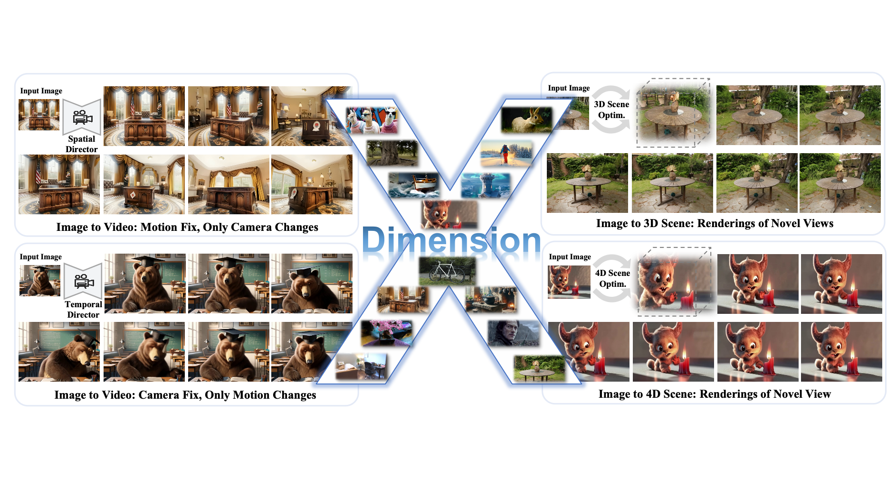
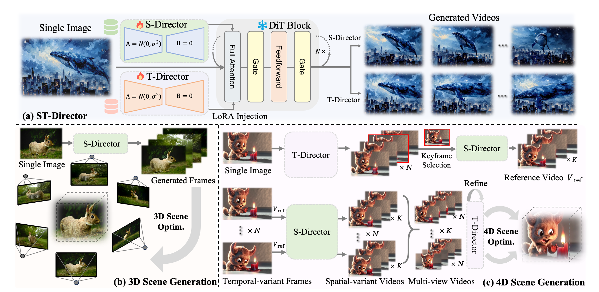

# DimensionX: Create Any 3D and 4D Scenes from a Single Image with Decoupled Video Diffusion (ICCV2025)

[**Paper**](https://arxiv.org/abs/2411.04928) | [**Project Page**](https://chenshuo20.github.io/DimensionX/) | [**Video**](https://youtu.be/ViDQI1HMY2U?si=f1RGd82n6yj6TOFB) | [**🤗 Model Checkpoints**](https://huggingface.co/ShuoChen20/DimensionX_12_basic_camera_lora/tree/main)

Official implementation of DimensionX: Create Any 3D and 4D Scenes from a Single Image with Decoupled Video Diffusion

[Wenqiang Sun*](https://github.com/wenqsun), [Shuo Chen*](https://chenshuo20.github.io/), [Fangfu Liu*](https://liuff19.github.io/), [Zilong Chen](https://scholar.google.com/citations?user=2pbka1gAAAAJ), [Yueqi Duan](https://duanyueqi.github.io/), [Jun Zhu](https://ml.cs.tsinghua.edu.cn/~jun/index.shtml), [Jun Zhang](https://eejzhang.people.ust.hk/), [Yikai Wang](https://yikaiw.github.io/)

Abstract: *In this paper, we introduce DimensionX, a framework designed to generate photorealistic 3D and 4D scenes from just a single image with video diffusion. Our approach begins with the insight that both the spatial structure of a 3D scene and the temporal evolution of a 4D scene can be effectively represented through sequences of video frames. While recent video diffusion models have shown remarkable success in producing vivid visuals, they face limitations in directly recovering 3D/4D scenes due to poor spatial and temporal controllability during generation. To overcome this difficulty, we propose ST-Director, which decouples spatial and temporal factors in video diffusion by learning dimension-aware directors from dimension-variant data. This decoupled video diffusion enables precise manipulation of spatial structures and temporal dynamics, allowing us to reconstruct both 3D and 4D representations from sequential frames by combining spatial and temporal dimensions. Additionally, to bridge the gap between generated videos and real-world scenes, we introduce a trajectory-aware mechanism for 3D generation and an identity-preserving denoising strategy for 4D generation, respectively. Extensive experiments on various real-world and synthetic datasets demonstrate that DimensionX achieves state-of-the-art performance in decoupled video generation, as well as 3D and 4D scene generation.*
<p align="center">
    
</p>

## Project Updates

- 🔥🔥 News: ```2025/8/20```: All components of our project—including S-Director checkpoints, training pipeline, datasets, 360-degree orbit model, and 3D scene optimization code—have been fully open-sourced and are available for public use.

- 🔥🔥 News: ```2024/11/15```: The Hugging Face online demo is now available! You can try it [here](https://huggingface.co/spaces/fffiloni/DimensionX). Thanks to [fffiloni](https://huggingface.co/fffiloni) for building it!

- 🔥🔥 News: ```2024/11/12```: We have released the Orbit Left and Orbit Up S-Director models. You can download them [here](https://huggingface.co/wenqsun/DimensionX).

## Todo List
- [x] Release part of model checkpoints (S-Director): orbit left & orbit up.
- [x] Release all model checkpoints.
    - [x] The rest S-Directors
    - [x] T-Director
    - [x] Long video generation model (145 frames)
    (training code + checkpoint)
- [x] 3dgs optimization code
- [x] Training dataset
- [ ] Identity-preserving denoising code for 4D generation

## Environment Setup

```bash
conda create --name dimensionx python=3.10 -y
conda activate dimensionx
conda install pytorch torchvision torchaudio pytorch-cuda=12.1 cuda -c pytorch  -c "nvidia/label/cuda-12.1.0" -c "nvidia/label/cuda-12.1.1"
pip install -r cogvideo/requirements.txt
```

## Any Camera Control Video Generation

### Model checkpoints

<table style="border-collapse: collapse; width: 100%;">
<tr>
<th style="text-align: center;">Model Name</th>
    <th style="text-align: center;">12 Basic Camera Lora</th>
    <th style="text-align: center;">4 Orbit Lora</th>
    <th style="text-align: center;">T Director</th>
</tr>
<tr>
    <td style="text-align: center;">Download Link (Diffusers)</td>
    <td style="text-align: center;"><a href="https://huggingface.co/ShuoChen20/DimensionX_12_basic_camera_lora/tree/main">🤗 HuggingFace</a></td>
    <td style="text-align: center;"><a href="https://huggingface.co/ShuoChen20/DimensionX_4_orbit_camera_lora/tree/main">🤗 HuggingFace</a></td>
    <td style="text-align: center;"><a href="https://huggingface.co/ShuoChen20/DimensionX_T_director_lora/tree/main">🤗 HuggingFace</a></td>
</tr>

</table>


We provide 12 fundamental camera LoRA modules, each corresponding to one of the six degrees of freedom (DoF) in camera motion. For each DoF—covering both translation and rotation—both positive and negative directions are modeled, resulting in a total of 12 distinct motion patterns.
In addition, we offer 4 orbit-style LoRA modules that represent orbital camera movements in the upward, downward, leftward, and rightward directions.

We also provide the T-Director checkpoint. All checkpoints are implemented as Diffuser LoRA modules. You can download them via the link above and perform inference using the script below—just replace the LoRA path and module name as needed.


### Inference 

For better result, you'd better use VLM to caption the input image. On a single NVIDIA A100/A800 GPU, inference with the LoRA model takes approximately 3 minutes and consumes 26.33 GB of GPU memory to generate a 6-second, 48-frame video.

```bash
python inference.py --lora_path ./your_lora_path.safetensors
```

Using the above inference command, you can achieve the controllable video generation!

We also provide a gradio demo web UI for our model. Thanks to the gradio demo in [CogvideoX](https://github.com/THUDM/CogVideo), we implement our model in `src/gradio_demo/app.py`

### Training

#### Training Preparation

Step1. Download our dataset from the provided \[link].

Step2. Download the base model checkpoint.

Download the **CogVideoX-5B-I2V-sat** checkpoint by following the instructions in the [official guide](https://github.com/THUDM/CogVideo/blob/main/sat/README.md).
Our codebase use the [CogVideoX-5B-I2V](https://cloud.tsinghua.edu.cn/d/5cc62a2d6e7d45c0a2f6/?p=%2F1&mode=list) model as the base model for training.
Alternatively, you may experiment with other models such as **CogVideoX1.5**, [**HunyuanVideo**](https://github.com/Tencent-Hunyuan/HunyuanVideo-I2V), or [**WanX**](https://github.com/Wan-Video/Wan2.1).

Step3. Modify training configurations
1. Update the **T5 model path** and **VAE model path** in `configs/cogvideox_5b_i2v_lora.yaml`.
   Detailed instructions can be found in the [SAT configuration guide](https://github.com/THUDM/CogVideo/blob/main/sat/README.md). Or you can following the command below:

   ```bash
   # Download vae
    mkdir CogVideoX-2b-sat
    cd CogVideoX-2b-sat
    wget https://cloud.tsinghua.edu.cn/f/fdba7608a49c463ba754/?dl=1
    mv 'index.html?dl=1' vae.zip
    unzip vae.zip
    # Download t5
    git lfs install
    git clone https://huggingface.co/THUDM/CogVideoX-2b.git # Download model from Huggingface
    # git clone https://www.modelscope.cn/ZhipuAI/CogVideoX-2b.git # Download from Modelscope
    mkdir t5-v1_1-xxl
    mv CogVideoX-2b/text_encoder/* CogVideoX-2b/tokenizer/* t5-v1_1-xxl
   ```


2. Modify `configs/sft_scene.yaml` to set up your training experiment:

   * Update the `transformer_path` to the base model directory
   * Set `train_data` and `valid_data` to your dataset paths
   * Specify the `caption_dir` containing text annotations


#### Run training

Then, start training using the following command:

```bash
cd cogvideo
bash finetune_multi_gpus.sh
```

**After training, you can run `inference.sh` to generate sample results.**
Make sure to modify the inference configuration file `inference.yaml` as needed.

If you would like to convert the training checkpoint into the **Diffuser LoRA** format, please refer to [this script](https://github.com/THUDM/CogVideo/blob/main/tools/convert_weight_sat2hf.py) for the conversion process.

## Single View 3D Generation (360 Degree Orbit)

## Inference

### Download checkpoint
**Model checkpoint:** [🤗 Hugging Face](https://huggingface.co/ShuoChen20/DimensionX_360orbit/tree/main). Download the model use following command:

```bash
mkdir checkpoints
mkdir checkpoints/1
huggingface-cli download ShuoChen20/DimensionX_360orbit mp_rank_00_model_states.pt --local-dir ./checkpoints/1
huggingface-cli download ShuoChen20/DimensionX_360orbit latest --local-dir ./checkpoints
```

To use the model, first download the T5 and VAE models and above checkpoint. Then, update the corresponding checkpoint paths for the **main model**, the **T5 model**, and the **VAE model** in the `inference_145.yaml` and `configs/cogvideox_5b_i2v_lora_145.yaml `configuration files.

Arrange the model files in the following structure:

```
.
checkpoints
   ├── 1
   │   └── mp_rank_00_model_states.pt
   └── latest
```

### 145 frame video generation

```bash
cd cogvideo
bash inference_lowR.sh
```

On a single NVIDIA A6000 GPU, the model generates a 145-frame, 18-second, 360-degree orbit video in approximately 6 minutes, utilizing about 30.52 GB of VRAM.

For improved visual quality, you can apply [Real-ESRGAN](https://github.com/xinntao/Real-ESRGAN) for super-resolution and use [RIFE](https://github.com/hzwer/ECCV2022-RIFE) for video frame interpolation.

<table border="0" style="width: 100%; text-align: left; margin-top: 20px;">
  <tr>
      <td>
          <video src="https://github.com/user-attachments/assets/a41cc3ec-47cf-4045-8f5c-60f2385c4774" width="100%" controls autoplay loop></video>
      </td>
      <td>
          <video src="https://github.com/user-attachments/assets/9925df57-e575-4da8-b22f-64257b494313" width="100%" controls autoplay loop></video>
      </td>
       <td>
          <video src="https://github.com/user-attachments/assets/589f2c69-0423-4782-8558-2edc1ae4f02f" width="100%" controls autoplay loop></video>
     </td>
      <td>
          <video src="https://github.com/user-attachments/assets/bcafa005-a1ab-4204-8bc4-60b7b093f973" width="100%" controls autoplay loop></video>
     </td>
  </tr>
</table>

## 3D Scene Optimization

We reconstruct a 3D scene from the generated video using Dust3R and Gaussian Splatting optimization.

### Environment Setup

Please follow the environment setup instructions provided in the [InstantSplat](https://github.com/NVlabs/InstantSplat) repository.

1. Download pre-trained model.

```bash
cd instantsplat
mkdir -p dust3r/checkpoints/
wget https://download.europe.naverlabs.com/ComputerVision/DUSt3R/DUSt3R_ViTLarge_BaseDecoder_512_dpt.pth -P dust3r/checkpoints
```

2. Create the environment

```bash
conda create -n instantsplat python=3.10.13 cmake=3.14.0 -y
conda activate instantsplat
conda install pytorch torchvision pytorch-cuda=12.1 -c pytorch -c nvidia  # use the correct version of cuda for your system
pip install -r requirements.txt
pip install submodules/simple-knn
pip install submodules/diff-gaussian-rasterization
pip install submodules/fused-ssim
```

### Dust3R Inference and Gaussian Splatting Optimization Pipeline

We have created a command to run the entire pipeline. Feel free to modify the paths and parameters in `pipeline.sh` to suit your needs before running the script:

```bash
bash pipeline.sh
```

## Method
Our framework is mainly divided into three parts. (a) Controllable Video Generation with ST-Director. We introduce ST-Director to decompose the spatial and temporal parameters in video diffusion models by learning dimension-aware LoRA on our collected dimension-variant datasets.  (b) 3D Scene Generation with S-Director. Given one view, a high-quality 3D scene is recovered from the video frames generated by S-Director.  (c) 4D Scene Generation with ST-Director. Given a single image, a temporal-variant video is produced by T-Director, from which a key frame is selected to generate a spatial-variant reference video. Guided by the reference video, per-frame spatial-variant videos are generated by S-Director, which are then combined into multi-view videos. Through the multi-loop refinement of T-Director, consistent multi-view videos are then passed to optimize the 4D scene.

<p align="center">
    
</p>


## Notice
Due to the conflict of the LoRA conversion and fuse_lora function in diffusers, you may meet the issue below:

```python
File "/app/src/video_generator/__init__.py", line 7, in <module>
    model_genvid = CogVideo(configs)
                   ^^^^^^^^^^^^^^^^^
  File "/app/src/video_generator/cog/__init__.py", line 82, in __init__
    self.pipe.fuse_lora(adapter_names=["orbit_left"], lora_scale=1 / lora_rank)
  File "/usr/local/lib/python3.11/dist-packages/diffusers/loaders/lora_pipeline.py", line 2888, in fuse_lora
    super().fuse_lora(
  File "/usr/local/lib/python3.11/dist-packages/diffusers/loaders/lora_base.py", line 445, in fuse_lora
    raise ValueError(f"{fuse_component} is not found in {self._lora_loadable_modules=}.")
ValueError: text_encoder is not found in self._lora_loadable_modules=['transformer'].
```
you can solve this error by skipping that part:
```python
for fuse_component in components:
    if fuse_component == 'text_encoder':
    continue
```


## Acknowledgement
- [CogVideoX](https://github.com/THUDM/CogVideo)
- [ReconX](https://github.com/liuff19/ReconX)
- [InstantSplat](https://github.com/NVlabs/InstantSplat)

From ReconX to DimensionX, we are conducting research about X! Our X Family is coming soon ...

## Citation

If you find this codebase useful for your research, please kindly cite our paper:

```bibtex
@article{sun2024dimensionx,
  title={DimensionX: Create Any 3D and 4D Scenes from a Single Image with Controllable Video Diffusion},
  author={Sun, Wenqiang and Chen, Shuo and Liu, Fangfu and Chen, Zilong and Duan, Yueqi and Zhang, Jun and Wang, Yikai},
  journal={arXiv preprint arXiv:2411.04928},
  year={2024}
}
```
